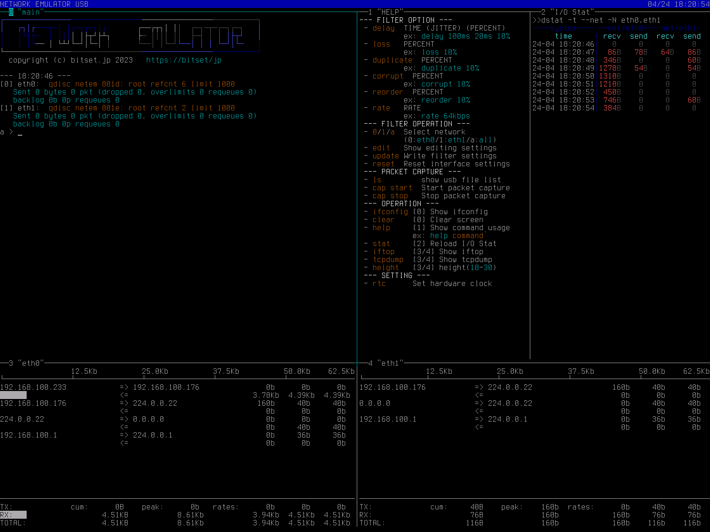

AGGRESSOR NETWORK
======================

`AGGRESSOR NETWORK` はLinux上で動作するネットワークエミュレータで、
Linuxの提供する tc-netem (Network Emulator) に対する簡易UIを提供します。

   

機能
-----

このソフトウェアでは主に以下のことが出来ます。

ネットワークエミュレーション機能:

- パケット遅延
- パケットロス
- パケット破損
- パケット重複
- パケット順序入れ替え
- 帯域制限

その他の機能:

- パケットキャプチャ (pcap)
- 通信量の表示

動作環境
-----------

Raspberry Pi 4 向けに調整・動作確認しています。

Hardware:

- Raspberry Pi 4
- USB to Ethernet Adapter (x1)
- RTC Module (x1)
  Pi RTC DS1307 (https://wiki.seeedstudio.com/Pi_RTC-DS1307/)

Software:

- Raspberry Pi OS (32-bit) Lite

ユーザーマニュアル
--------------------

`日本語マニュアル <https://bitset-jp.github.io/aggressor_network_man_ja/>`_

`English Manual <https://bitset-jp.github.io/aggressor_network_man_en/>`_
